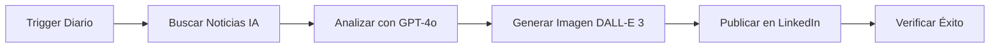

# 🤖 LinkedIn AI Trends Automation para n8n Cloud

Automatización completa para generar y publicar posts diarios en LinkedIn sobre las últimas tendencias de Inteligencia Artificial, incluyendo generación de contenido con IA y creación de imágenes con DALL-E 3.

## ✨ Características

- 🔄 **Completamente Automatizado**: Se ejecuta todos los días sin intervención manual
- 📰 **Noticias en Tiempo Real**: Busca las últimas tendencias de IA de las últimas 24 horas
- 🧠 **Contenido Generado con IA**: Usa GPT-4o para crear posts profesionales y atractivos
- 🎨 **Imágenes Únicas**: Genera imágenes HD personalizadas con DALL-E 3
- 🌐 **Multi-idioma**: Configurable en cualquier idioma (por defecto: español)
- 📊 **Monitoreo de Estado**: Sistema de notificaciones de éxito/error
- 🎯 **Optimizado para Engagement**: Posts diseñados para maximizar interacción

## 🚀 Inicio Rápido

### 1. Importar en n8n

```bash
# En n8n Cloud:
Workflows > Add Workflow > Import from File > linkedin-ai-trends-automation.json
```

### 2. Configurar APIs

Necesitarás:
- ✅ NewsAPI Key (gratuito - https://newsapi.org/)
- ✅ OpenAI API Key (https://platform.openai.com/)
- ✅ LinkedIn OAuth2 (configuración en n8n)

### 3. Activar

Configura las credenciales y activa el workflow. ¡Listo!

## 📖 Documentación Completa

Para instrucciones detalladas de instalación y configuración, consulta:

➡️ **[SETUP-GUIDE.md](./SETUP-GUIDE.md)**

## 🎯 ¿Qué Hace Este Workflow?



1. **Se activa automáticamente** cada día a las 9:00 AM
2. **Busca noticias** sobre IA usando NewsAPI
3. **Analiza y genera** contenido profesional con GPT-4o
4. **Crea una imagen** única y relevante con DALL-E 3
5. **Publica automáticamente** en tu LinkedIn

## 💡 Ejemplo de Output

### Post Generado:

```
🚀 La nueva era de la IA conversacional está aquí

OpenAI acaba de lanzar GPT-5, y los resultados son impresionantes.
Esta nueva versión no solo entiende contexto mejor que nunca,
sino que puede razonar sobre problemas complejos de manera más humana.

¿Qué significa esto para las empresas?

✅ Automatización más inteligente
✅ Atención al cliente más natural
✅ Análisis de datos más profundo

La pregunta ya no es "¿debería mi empresa usar IA?"
sino "¿cómo puedo integrarla de forma efectiva?"

#ArtificialIntelligence #AI #Innovation #Tech #LinkedIn
```

+ Imagen HD generada personalizada 🎨

## 🛠️ Tecnologías Utilizadas

- **n8n**: Plataforma de automatización workflow
- **GPT-4o**: Generación de contenido (OpenAI)
- **DALL-E 3**: Generación de imágenes (OpenAI)
- **NewsAPI**: Búsqueda de noticias en tiempo real
- **LinkedIn API**: Publicación automatizada

## 📊 Estructura del Workflow

El workflow incluye 13 nodos:

1. Schedule Trigger (Cron)
2. Fetch AI News (NewsAPI)
3. Process News Data
4. OpenAI Content Generation (GPT-4o)
5. Parse OpenAI Response
6. DALL-E 3 Image Generation
7. Download Generated Image
8. LinkedIn Upload Image
9. LinkedIn Create Post
10. Check Post Success
11. Success Notification
12. Error Notification

## 💰 Costos Estimados

| Servicio | Costo Diario | Costo Mensual |
|----------|--------------|---------------|
| OpenAI (GPT-4o + DALL-E 3) | ~$0.095 | ~$2.85 |
| NewsAPI (Free) | $0 | $0 |
| LinkedIn | $0 | $0 |
| n8n Cloud (Starter) | ~$0.66 | $20 |
| **TOTAL** | **~$0.76** | **~$22.85** |

## 🎨 Personalización

El workflow es altamente personalizable:

- ⏰ **Horario**: Cambia el cron expression
- 🌐 **Idioma**: Modifica el prompt y parámetros de NewsAPI
- 🎭 **Estilo**: Ajusta el tono del contenido (técnico, casual, profesional)
- #️⃣ **Hashtags**: Personaliza según tu audiencia
- 📅 **Frecuencia de noticias**: Últimas 24h, semana, etc.

## 📁 Archivos del Repositorio

```
├── linkedin-ai-trends-automation.json    # Workflow de n8n (IMPORTAR ESTE)
├── SETUP-GUIDE.md                        # Guía completa de configuración
├── README.md                             # Este archivo
└── urlinksSS - Paginas (1).csv          # [Archivo existente]
```

## 🧪 Pruebas

Para probar el workflow antes de activarlo:

1. Abre el workflow en n8n
2. Click en **"Execute Workflow"**
3. Revisa cada nodo para ver el output
4. Verifica que el post se publique correctamente

## 🔧 Solución de Problemas Comunes

| Problema | Solución |
|----------|----------|
| No encuentra noticias | Verifica NewsAPI key y límite de requests |
| Error OpenAI | Comprueba créditos y validez del API key |
| Fallo en LinkedIn | Reautentica OAuth2 y verifica permisos |
| Imágenes no se generan | Revisa logs de DALL-E 3 y formato de prompt |

➡️ Ver [SETUP-GUIDE.md](./SETUP-GUIDE.md) para más detalles

## 🚀 Mejoras Futuras

Ideas para extender el workflow:

- [ ] Sistema de A/B testing para optimizar engagement
- [ ] Analytics dashboard con métricas de performance
- [ ] Publicación multi-plataforma (Twitter, Facebook)
- [ ] Generación de videos cortos en lugar de imágenes
- [ ] Sistema de aprobación manual antes de publicar
- [ ] Integración con calendario de contenidos

## 🤝 Contribuciones

¿Tienes ideas para mejorar el workflow? ¡Las contribuciones son bienvenidas!

## 📝 Licencia

Este proyecto es de código abierto y está disponible para uso y modificación libre.

## ⚠️ Disclaimer

Este workflow usa APIs de terceros. Asegúrate de:
- ✅ Cumplir con los términos de servicio de cada plataforma
- ✅ Revisar los límites de uso de las APIs
- ✅ Monitorear los costos asociados
- ✅ Respetar las políticas de contenido de LinkedIn

## 📧 Soporte

Para preguntas o problemas:
- 📚 [Documentación n8n](https://docs.n8n.io/)
- 💬 [Comunidad n8n](https://community.n8n.io/)
- 🤖 [OpenAI Docs](https://platform.openai.com/docs/)

---

**Desarrollado con ❤️ para automatizar tu presencia en LinkedIn**

¿Te gusta este proyecto? ⭐ Dale una estrella en GitHub
